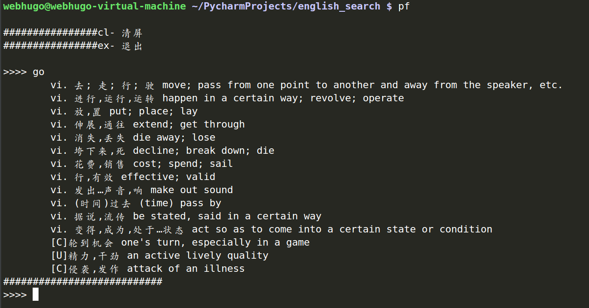

### 这是一个终端集成英语翻译的脚本

**是否苦恼于每次想查单词都要打开浏览器？**
**那么这个脚本可以帮你，这是一个基于python的脚本**



1. 如果你还没安装pip
```
sudo apt install pip
```

2. 进入该目录下,运行
```
sudo python add_as_script.py
```

**大功告成，下次你想查单词，直接运行**
```
pf
```
**然后输入单词就好**
```
go
```

